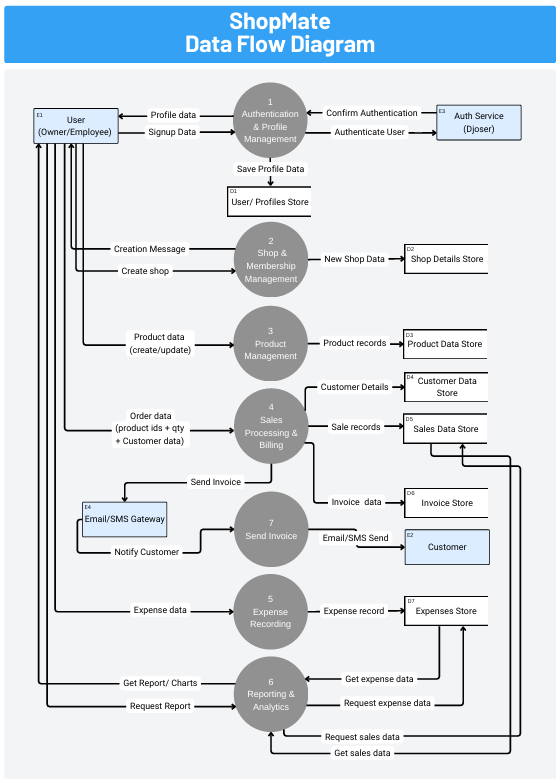

# ShopMate

ShopMate is a full-stack web application designed to help shop owners manage products, track sales, and calculate profit efficiently. It provides a clean dashboard for business insights and simplifies day-to-day shop management.

## Overview

Managing a shop manually can lead to errors, missing records, and incorrect profit calculations. ShopMate solves this by providing a centralized system to manage:

- products and inventory
- sales and transactions
- revenue and expenses
- profit calculations

The goal of this project is to build a SaaS-style retail management system using modern web technologies.
### Use Case Diagram



### Data Flow Diagram (DFD)


## Features

### User Roles
- Admin
- Shop Owner
- Employee


### Product Management
- Add, edit, delete products
- Upload product images
- Track stock levels

### Sales Management
- Record daily sales
- Track order history
- Monitor total revenue

### Profit Calculation
- Automatic profit calculation
- Cost vs selling price tracking
- Revenue insights

### Search & Filter
- Search products easily
- Filter by category or price

### Dashboard
- Overview of business performance
- Key metrics (sales, profit, inventory)

## Tech Stack


### Frontend
- React (with modern features)
- Tailwind CSS

### Backend
- Django
- Django REST Framework

### Database
- PostgreSQL


### Tools
- Git & GitHub
- Virtual Environment
- REST API integration

## Project Structure
```bash
ShopMate/
│
├── backend/
│   ├── models/
│   ├── serializers/
│   ├── views/
│   ├── urls.py
│   └── settings.py
│
├── frontend/
│   ├── components/
│   ├── pages/
│   ├── services/
│   └── assets/
│
├── database/
├── requirements.txt
└── README.md
````


## Installation

### 1. Clone the Repository

```bash
git clone https://github.com/AsifIqbal011/shopmate.git
cd shopmate
````

### 2. Backend Setup (Django)

```bash
cd backend
python -m venv venv
source venv/bin/activate   # for Linux/macOS
venv\Scripts\activate      # for Windows

pip install -r requirements.txt
```

Run migrations:

```bash
python manage.py makemigrations
python manage.py migrate
```

Start backend server:

```bash
python manage.py runserver
```

### 3. Frontend Setup (React)

```bash
cd frontend
npm install
npm run dev
```

## Environment Variables

Create a `.env` file in backend:

```env
SECRET_KEY=your_secret_key
DEBUG=True
DATABASE_URL=your_postgresql_url
```

## API Endpoints (Example)

* `/api/products/` → Get all products
* `/api/products/create/` → Add product
* `/api/products/<id>/` → Update/Delete product
* `/api/sales/` → Manage sales

## Screenshots

(Add your UI screenshots here)

## Future Improvements

* AI-based sales prediction
* Multi-shop support
* Mobile app version
* Advanced analytics dashboard
* Role-based permission control
* Invoice generation system

## Use Case

ShopMate is ideal for:

* small business owners
* retail shops
* grocery stores
* local businesses

It replaces manual record-keeping with a smart digital system, improving accuracy and efficiency.


## Author

Asif Iqbal
GitHub: [https://github.com/AsifIqbal011](https://github.com/AsifIqbal011)

